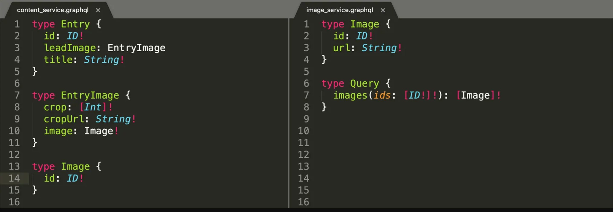

# Causal data GraphQL API PoC. Microservices or DataSources?

The goal of this document is to provide a quick overview of methods of how we could capture several types of events such as Sales events, Weather and Holidays events from 3rd party datasources and store them into a datastore. The document also provides information of how we can split the API into micro-services using GraphQL as a gateway.

- Schema Stitching
- gRPC
- Apollo Federation

## Schema stitching

Schema stitching is the process of creating a single GraphQL schema from multiple underlying GraphQL APIs. Given two self-contained subschemas, a single **stitched** schema can be built that delegates (or, proxies) relevant portions of a request to each subservice.


The end goal of this process is to have a very specific workflow – the client makes a request to the API, which is then sent to a proxy layer of translation. At this layer, the request is split to several different APIs, with each responding to the request with the portion of data they’re responsible for. Next, these responses are combined together, again in the proxy layer. This combined response is then sent to the client through the Master API output.

Schema stitching makes it possible to create one schema out of multiple schemas. Using a microservices architecture at the backend where each microservice handles the business logic and data for a specific domain. In this case, each microservice can define its **own GraphQL schema**, after which you'd use schema stitching to weave them into one that is accessed by the client.



Each microservice can have its own GraphQL endpoint, where one GraphQL API gateway consolidates all schemas into one global schema.

Pros

- Query against only one schema, so we don’t have to track which queries are associated with which API
- Do one request to get the information we need
- Adding links between types

Cons

- It does not automatically update schema when internal APIs are updated, so you need to re-launch gateway server in some way to update schema. Could be done with deployment trigger though.
- It doesn't have namespaces, so you need to solve name conflicts manually at gateway level if you have them.
- It swallows detailed error info (such as stacktraces) from internal API.
- It does not currently support file uploads. You need to use some workaround to be able to upload a file to internal services.

## gRPC micro-services

RPC is a form of inter-process communication that allows procedures to be invoked across machines and networks. One RPC framework gaining traction is Google’s gRPC.

The GraphQL API acts as a gateway/proxy for the different micro-services it exposes. The resolvers of the GraphQL API make calls to the gRPC micro-services through client-server communication. The services and the data interchange are defined using **Protocol Buffers**. The gRPC micro-services handle and fulfil the requests whether they are database operations or any other internal or external calls.

In general

- The **GraphQL server** is in front of the client as our unique **entry point**. Its role is mainly to validate input data (required / optional fields, type, …) and filter output data. It also acts as a _client_ to the gRPC micro-service.

- A **gRPC server**, to perform all functional operations.


This architecture implements the following Micro-service Design Patterns:

1. Microservice Architecture

**gRPC (Google Remote Procedure Call):** was chosen as the tool to do the micro-services (_MaliJS_ framework).

**gRPC** is an open-source RPC architecture designed by Google to achieve high-speed communication between micro-services. gRPC uses the **Protobuf** (protocol buffers) messaging format, which is a highly-packed, highly-efficient messaging format for serialising structured data. its also supports multi-language implementations. Like many RPC systems, gRPC is based around the idea of defining a service, specifying the methods that can be called remotely with their parameters and return types. By default, gRPC uses protocol buffers as the Interface Definition Language (IDL) for describing both the service interface and the structure of the payload messages.

**Protocol buffers** was used as the data interchange format between the client (GraphQL API) and the server (gRPC micro-services) for serialising structured data in gRPC. This is the contract between the client and the server.

For instance the gRPC server exposes 1 proto3 contract:

**Weather.proto**, a contract to list weather data information.

```
package  weatherService;

...other messages

message  WeatherData {
	string  cod = 1;
	WeatherCity  city = 2;
	repeated  WeatherItem  list = 3;
}

message  getWeatherDataByCityRequest {
	string  city = 1;
}

service  WeatherService {
	rpc  getWeatherDataByCity (getWeatherDataByCityRequest) returns (WeatherData) {}
	rpc transformWeatherData (transformWeatherRequest) returns (TransformedWeatherData)
}
```

Protocol buffer data is structured as messages, where each message is a small logical record of information containing a series of name-value pairs called fields.

2. Subdomain Decomposition

Define services that responds to different business domains.

3. Externalized Configuration

Externalize all application configuration including the database credentials and network location. For example, on startup, a service can handle it.

4. Remote Procedure Invocation

To communicate between the services RPI (Remove Procedure Invocation) is used for inter-service communication. The client uses a request/reply-based protocol to make requests to a service.

5. API Gateway

In order clients of a Microservices-based application to access the individual services GraphQL acts as the API Layer for the architecture. It takes care of listening for client requests and calling the appropriate back-end microservice to fulfill them.

Pros

- Lightweight messages. Depending on the type of call, gRPC-specific messages can be up to 30 percent smaller in size than JSON messages.
- High performance. By different evaluations, gRPC is faster than REST+JSON communication.
- More connection options. gRPC provides support for data streaming with event-driven architectures: server-side streaming, client-side streaming, and bidirectional streaming.
- Real-time communication services

Cons

- Both client and server need to support the same Protocol Buffers specification.
- Updates to the .proto file need to be carefully coordinated. (related to 1)
- Learning curve.
- Not human-readable format: To analyze payloads, perform debugging, and write manual requests, we must use extra tools like **gRPC command line tool** because data is compressing to a binary format.

## Apollo Federation

Apollo Federation is an approach for composing multiple GraphQL services into one data graph, queryable from a single GraphQL server. Federation combines the GraphQL APIs from multiple (microservice) into a single API.

Federation leans heavily into a declarative SDL (schema definition language) for its operations. Unlike other distributed GraphQL architectures (such as schema stitching), Apollo Federation uses a declarative programming model that makes it easy for each implementing service to implement only the part of the data graph that it should be responsible for.


The Gateway reads the federated Schemas, and based on the information they provide, it stitches it all together, without having to write any code in the stitching layer. But each service should supports federation during implementation.


With Stitching, all the work is done in the external service, so the backend services do not have to know about it.
With Federation, all the backend services have to be aware that they are part of something bigger in order to participate in that bigger picture.

A previous document on federation by Shane

https://gitlab.td.gfk.com/ecosystem/client-platform-gateway#

## Apollo DataSources (alternative to microservices)

Data sources are classes that Apollo Server can use to encapsulate fetching data from a particular source, such as a database or a REST API. These classes help handle caching, deduplication, and errors while resolving operations.

The server can use any number of different data sources.


